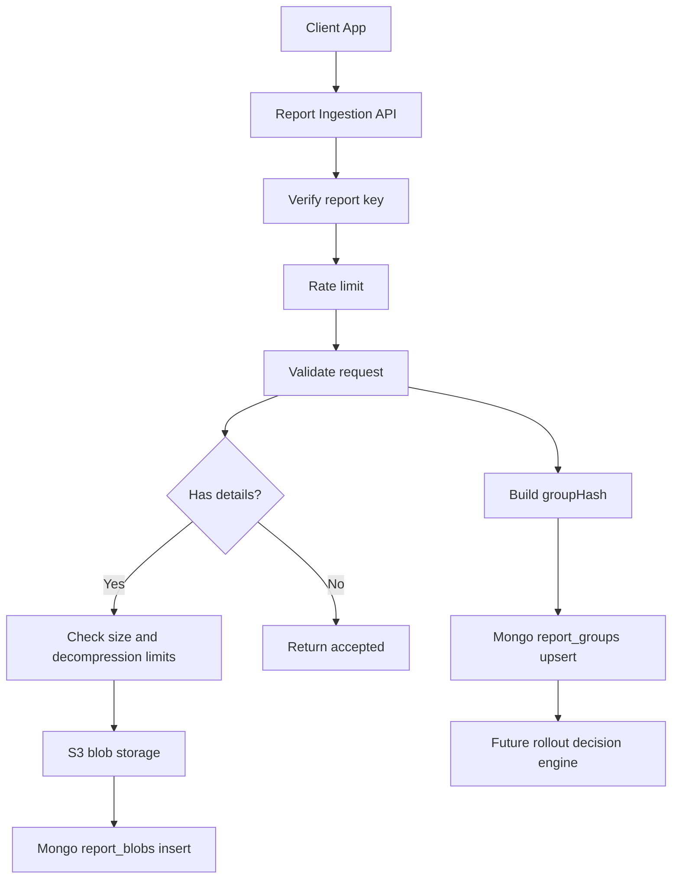
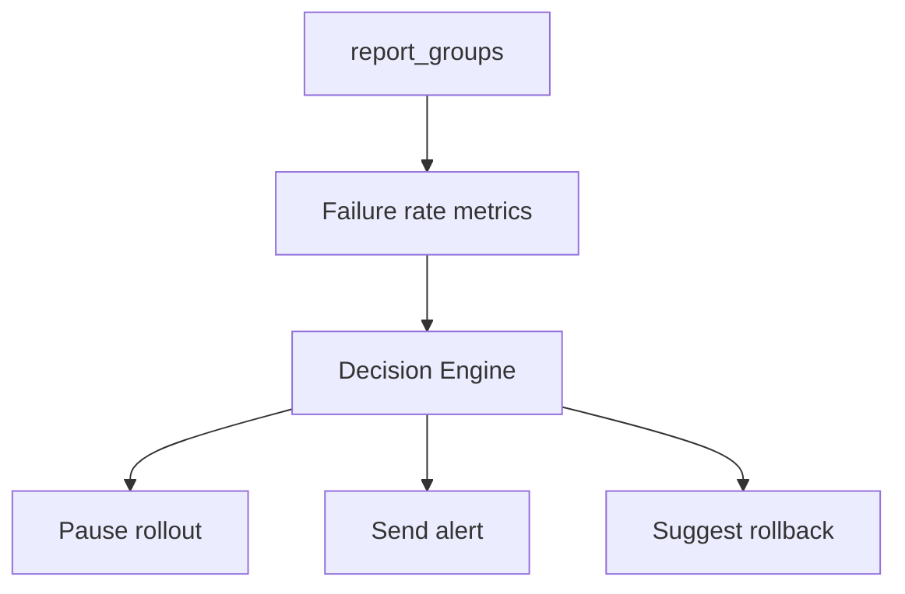

# Report Ingestion Vision

## 1. Purpose

This document describes the vision for report ingestion in faynoSync: how clients should send operational reports, how the server should validate, group, store, and use them for future rollout analytics.

This is not an implementation checklist. It is a shared framework for thinking about API, data, limits, and tradeoffs before implementation.

The core idea: reports should be cheap to ingest, stable for aggregation, and informative enough for debugging, without turning faynoSync into an APM, logging, or crash analytics platform.

## 2. Product goals

- Give clients a simple endpoint for sending update/install/runtime failure reports.
- Give the server an aggregated view of rollout health by app/version/channel/platform/arch.
- Keep storage growth bounded: no unbounded arrays, large raw payloads in Mongo, or uncontrolled blobs.
- Keep the client simple: the client sends a short reason and optional details; the server handles grouping, storage, and rate limits.
- Lay the groundwork for a future auto-pause/rollback decision engine.

## 3. General goals

- Collect as little user personal data as possible.
- Do not build a general-purpose logging pipeline.
- Do not build a full APM or Sentry replacement.
- Do not use reports as a source of trust for update metadata.
- Do not change TUF metadata verification, signing, expiration, versioning, or rollback/freeze protection.

## 4. Current context

faynoSync already has a lifecycle for report keys:

- `report_keys` collection;
- one report key per app with `reports` enabled;
- key format `rpk_` + 64 hex;
- admin/team API for list/regenerate.

There is no public endpoint for accepting report events yet. The new ingestion API should use the existing `rpk_` key concept but must not require JWT or admin auth from the client.

Report ingestion should be enabled by a separate env flag, similar to TUF routes:

```go
if config.GetBool("REPORTS_ENABLED") {
    // setup report ingestion routes
}
```

If `REPORTS_ENABLED=false`, the ingestion endpoint must not be active.

## 5. High-level flow



The basic path without details should be as cheap as possible: validate -> hash -> one Mongo upsert -> response.

## 6. API surface

### Recommended endpoint

```http
POST /reports/ingest
Authorization: Bearer rpk_<64_hex>
X-Device-ID: <anonymous_device_id>
Content-Type: application/json
```

Use `Authorization: Bearer rpk_...` because it is the standard mechanism for bearer credentials and avoids adding a custom auth header unnecessarily.

`X-Device-ID` must be an anonymous technical identifier already used for statistics. It is needed for rate limits and optional dedup, but must not be included in `groupHash` and must not be stored in persistent report documents.

## 7. Event types

For MVP, event type must be a strict enum:

- `crash`
- `startup_failure`
- `update_failure`
- `install_failure`
- `rollback_failure`

New event types are added only via server enum and documentation. The client cannot send arbitrary event types; otherwise analytics quickly becomes noisy and incompatible across SDKs.

## 8. Reason (`reason`)

`reason` is a short machine-readable identifier.

Validation:

```regex
^[a-zA-Z0-9._-]{1,128}$
```

Examples:

- `checksum_mismatch`
- `disk_full`
- `access_denied`
- `missing_dependency`
- `panic_nil_pointer`
- `signature_verification_failed`

`reason` must not contain stack traces, HTML, logs, binary data, or long human-readable messages.

This separation is important:

- `reason` is used for grouping, filters, charts, and alerting;
- `details` are used for debugging/support and do not affect grouping.

## 9. Minimal request

```json
{
  "application": {
    "name": "my-app",
    "version": "1.4.2",
    "channel": "stable"
  },
  "system": {
    "platform": "windows",
    "arch": "amd64"
  },
  "event": {
    "type": "update_failure",
    "reason": "checksum_mismatch"
  }
}
```

Required fields:

- `application.name`
- `application.version`
- `application.channel`
- `system.platform`
- `system.arch`
- `event.type`
- `event.reason`

Decision: send `application.name` and verify that the report key belongs to that app. This makes the request self-contained and reduces the risk of accidentally using the wrong key.

Verification direction: the server looks up the report key by `key_value` in `report_keys`, resolves its `app_id`, reads `apps_meta.app_name`, and compares it with `application.name` from the body. It also checks `app.Reports` is enabled. Because ingestion looks the key up on every request, `report_keys` MUST have an index on `key_value`; otherwise each ingest becomes a full collection scan.

## 10. Extended request with details

```json
{
  "application": {
    "name": "my-app",
    "version": "1.4.2",
    "channel": "stable"
  },
  "system": {
    "platform": "windows",
    "arch": "amd64"
  },
  "event": {
    "type": "update_failure",
    "reason": "checksum_mismatch"
  },
  "details": {
    "encoding": "gzip+base64",
    "content_type": "application/json",
    "payload": "H4sIAAAAA..."
  }
}
```

`details` are optional. If present, the server:

1. checks compressed size;
2. decodes base64;
3. decompresses gzip with a decompressed size limit enforced via `io.LimitReader` on the gzip stream (the server MUST NOT trust any declared/decompressed size from the client — this is the zip-bomb guard);
4. stores the payload in S3/R2;
5. writes metadata to `report_blobs`.

`details` are not included in `groupHash`.

## 11. Details payload format

For MVP, the payload may be a JSON object that the SDK or developers define themselves:

```json
{
  "message": "expected sha256 != actual sha256",
  "stack": "...",
  "logs": "..."
}
```

The server must not index or analyze this payload in MVP. It is a blob for debugging.

Decision: allow only gzip+base64 for extended details in the first version. This makes limits explicit and does not encourage clients to send large inline JSON logs.

## 12. Response format

### Successful response

```json
{
  "status": "accepted",
  "group_hash": "sha256...",
  "stored_details": true
}
```

For minimal request:

```json
{
  "status": "accepted",
  "group_hash": "sha256...",
  "stored_details": false
}
```

### Validation error

```json
{
  "error": "invalid event.reason"
}
```

### Rate limited response

```json
{
  "error": "rate limit exceeded"
}
```

### Unauthorized response

```json
{
  "error": "invalid report key"
}
```

Recommended HTTP statuses:

- `202 Accepted` for accepted reports;
- `400 Bad Request` for validation errors;
- `401 Unauthorized` for missing/invalid report key;
- `403 Forbidden` if reports are disabled for the app;
- `413 Payload Too Large` for request/details size violations;
- `429 Too Many Requests` for rate limit;
- `500 Internal Server Error` only for unexpected server/storage errors.

## 13. Grouping model

`groupHash` is deterministic and based only on stable dimensions:

```text
sha256(application.name + "|" + application.version + "|" + application.channel + "|" + system.platform + "|" + system.arch + "|" + event.type + "|" + event.reason)
```

The `|` separator is required to avoid ambiguous concatenations (e.g. `name="ab",version="1"` colliding with `name="a",version="b1"`). `|` is safe because none of the grouping fields can contain it: the `event.reason` regex excludes it, and the app/version/channel/platform/arch validators reject it.

Fields included in grouping:

- `application.name`
- `application.version`
- `application.channel`
- `system.platform`
- `system.arch`
- `event.type`
- `event.reason`

Fields excluded from grouping:

- `details.message`
- `details.stack`
- `details.logs`
- timestamps;
- client IP;
- user/device identifiers;
- blob storage key.

Rationale: stack traces and logs are often unique. If details affected grouping, every crash/report could become its own group.

## 14. Mongo collection: report_groups

One group = one Mongo document.

```json
{
  "_id": "ObjectId",
  "groupHash": "sha256...",
  "application": {
    "name": "my-app",
    "version": "1.4.2",
    "channel": "stable"
  },
  "system": {
    "platform": "windows",
    "arch": "amd64"
  },
  "event": {
    "type": "update_failure",
    "reason": "checksum_mismatch"
  },
  "stats": {
    "count": 182,
    "firstSeen": "2026-05-20T10:00:00Z",
    "lastSeen": "2026-05-20T12:00:00Z",
    "detailsStored": 17,
    "detailsRejected": 3
  },
  "createdAt": "2026-05-20T10:00:00Z",
  "updatedAt": "2026-05-20T12:00:00Z"
}
```

Recommended indexes:

`_id` is an auto-generated Mongo ObjectId; `groupHash` is the grouping identity. The upsert matches on `groupHash`, so the unique index on `groupHash` below is mandatory — it guarantees one group = one document under concurrent upserts.

```javascript
db.report_groups.createIndex({ groupHash: 1 }, { unique: true })
db.report_groups.createIndex({ "application.name": 1, "application.version": 1, "event.type": 1 })
db.report_groups.createIndex({ "application.name": 1, "application.channel": 1, "system.platform": 1, "stats.lastSeen": -1 })
db.report_groups.createIndex({ "stats.lastSeen": -1 })
```

## 15. Mongo upsert path

Ingestion count must be counted directly in MongoDB:

```javascript
db.report_groups.updateOne(
  { groupHash: hash },
  {
    $inc: {
      "stats.count": 1
    },
    $set: {
      "stats.lastSeen": now,
      "updatedAt": now
    },
    $setOnInsert: {
      "groupHash": hash,
      "application": {
        "name": "my-app",
        "version": "1.4.2",
        "channel": "stable"
      },
      "system": {
        "platform": "windows",
        "arch": "amd64"
      },
      "event": {
        "type": "update_failure",
        "reason": "checksum_mismatch"
      },
      "stats.firstSeen": now,
      "stats.detailsStored": 0,
      "stats.detailsRejected": 0,
      "createdAt": now
    }
  },
  { upsert: true }
)
```

If the request contains `details`, the base count must still be incremented regardless of whether the blob was stored. Details are a debug payload, and the fact of a failure report is important for rollout health.

After processing `details`, the server can make a separate lightweight update:

```javascript
db.report_groups.updateOne(
  { groupHash: hash },
  {
    $inc: {
      "stats.detailsStored": stored ? 1 : 0,
      "stats.detailsRejected": rejected ? 1 : 0
    },
    $set: {
      "updatedAt": now
    }
  }
)
```

Decision: do not require a transaction. If blob storage is temporarily unavailable, the grouped counter must still be written, and `detailsRejected` or server logs must show the loss of debug payload.

Redis is not needed for aggregation in MVP.

Redis should be used for:

- rate limits;
- optional short dedup cache;
- future realtime windows, if they are needed for rollout decisions.

## 16. Mongo collection: report_blobs

Do not store unlimited blob links inside `report_groups`.

Problematic model:

```json
{
  "groupHash": "sha256...",
  "storage": {
    "blobs": ["s3://...", "s3://...", "s3://..."]
  }
}
```

This grows indefinitely and may eventually hit Mongo document limits or make updates more expensive.

Recommended model:

```json
{
  "_id": "ObjectId",
  "groupHash": "sha256...",
  "application": {
    "name": "my-app",
    "version": "1.4.2",
    "channel": "stable"
  },
  "system": {
    "platform": "windows",
    "arch": "amd64"
  },
  "event": {
    "type": "update_failure",
    "reason": "checksum_mismatch"
  },
  "storage": {
    "driver": "aws",
    "bucket": "faynosync-reports",
    "key": "reports/my-app/2026/05/20/sha256...json.gz",
    "compressedSize": 42117,
    "decompressedSize": 188420,
    "contentType": "application/json",
    "encoding": "gzip"
  },
  "createdAt": "2026-05-20T12:00:00Z"
}
```

Recommended indexes:

```javascript
db.report_blobs.createIndex({ groupHash: 1, createdAt: -1 })
db.report_blobs.createIndex({ "application.name": 1, createdAt: -1 })
db.report_blobs.createIndex({ "application.name": 1, "application.version": 1, "event.type": 1, createdAt: -1 })
db.report_blobs.createIndex({ createdAt: 1 }, { expireAfterSeconds: 2592000 })
```

TTL is not required but strongly recommended if blob retention is not explicitly managed elsewhere.

Do not store the report key in `report_groups` or `report_blobs`; it already exists in `report_keys`. New collections should store only report data and storage metadata.

## 17. Blob storage strategy

MVP decision: keep the latest N blobs per group.

Recommendation:

- Use a separate `report_blobs` collection.
- Keep the latest N blobs per group.
- Configure blob count via env.
- When adding a new blob, if the group already has more than N blobs, delete the oldest blob records and corresponding storage objects.
- Add TTL for blob metadata and lifecycle rules in S3/R2.
- Keep `report_groups` small and stable.

Suggested defaults:

- compressed details limit: `128 KB`;
- decompressed details limit: `1 MB`;
- default blob retention: `30 days`;
- max stored blobs per group visible in UI: `10`.

Example env config:

```env
REPORTS_ENABLED=true
REPORTS_MAX_BODY_BYTES=262144
REPORTS_MAX_DETAILS_COMPRESSED_BYTES=131072
REPORTS_MAX_DETAILS_DECOMPRESSED_BYTES=1048576
REPORTS_BLOB_RETENTION_DAYS=30
REPORTS_MAX_BLOBS_PER_GROUP=10
REPORTS_STORAGE_PREFIX=reports
```

Report blobs must use the same storage provider as the rest of faynoSync storage, i.e. the current `STORAGE_DRIVER` and corresponding `S3_*` settings.

## 18. Rate limits

Because report ingestion is a public endpoint from the client's perspective, rate limits are mandatory.

Recommended dimensions:

- per report key;
- per app;
- per `X-Device-ID`;
- optional per groupHash.

Suggested MVP defaults:

- per report key: configurable;
- per `X-Device-ID` + groupHash: 1 request/hour;
- per groupHash: 30 requests/minute;
- burst: configurable.

The per-device limit MUST be scoped by `groupHash`, not global per device. A single device can legitimately emit different event types within an hour (e.g. `startup_failure`, then `update_failure`, then `crash`); a global 1/hour cap would silently drop those distinct reports and hide real rollout failures. Scoping by `device + groupHash` only suppresses repeats of the same failure, which is the intended dedup behavior.

Redis is the right place for rate limits.

Example keys:

```text
reports:rl:key:<report_key>:minute:<bucket>
reports:rl:device:<device_id>:group:<group_hash>:hour:<bucket>
reports:rl:group:<group_hash>:minute:<bucket>
```

Report keys are effectively public client keys (they ship inside the client and are stored in plaintext in `report_keys.key_value`, not hashed). They are not secrets: real abuse protection comes from the `REPORTS_ENABLED` gate, the per-app `app.Reports` flag, and these rate limits — not from key secrecy. For MVP there is no need to complicate Redis rate-limit keys with additional hashing. It is more important not to duplicate the report key in persistent report documents.

## 19. Validation rules

The server must reject the request before storage if:

- report key is missing or invalid;
- report key does not belong to `application.name`;
- `X-Device-ID` is missing or invalid;
- reports are disabled for the app;
- required fields are missing;
- `event.type` is not in the predefined enum;
- `event.reason` fails regex validation or exceeds length;
- request body exceeds configured size;
- compressed details exceed the limit;
- decompressed details exceed the limit;
- details encoding/content type is not supported.

For `application.name`, `application.channel`, `system.platform`, `system.arch`, and `application.version`, the server MUST reuse the existing validators (`IsValidAppName`, `IsValidChannelName`, `IsValidPlatformName`, `IsValidArchName`, `IsValidVersion`) already used by telemetry ingestion, instead of introducing new regexes. Only `event.reason` needs its own dedicated regex.

The decompressed-size limit MUST be enforced with `io.LimitReader` around the gzip reader; the server MUST NOT trust any client-declared decompressed size. If the limit is hit before EOF, reject with `413`.

The server should validate version syntax but must not require that the version exists in release metadata. Reports may come from old clients, failed installs, or environments where the server no longer has full release context.

## 20. Temporary dedup

Optional Redis dedup can reduce noisy repeats from a broken client loop.

Example:

```text
reports:dedup:<device_id>:<group_hash>:<hour_bucket>
```

Dedup is not required for MVP if rate limits are strict enough.

Important: dedup must not hide real rollout failures too aggressively. If a bad release breaks many clients, the server must still see the count grow.

## 21. Privacy boundary

Reports must avoid user identity.

Allowed technical dimensions:

- app name;
- version;
- channel;
- platform;
- arch;
- event type;
- reason;
- anonymous `X-Device-ID` for rate limits/dedup;
- technical details in an optional blob.

`X-Device-ID` must not be part of `groupHash` and must not be written to `report_groups` or `report_blobs`.

By default, avoid:

- email;
- username;
- machine hostname;
- device serial;
- IP as stored business data;
- arbitrary environment variables;
- full filesystem paths that may contain usernames.

Editing details, stripping secrets, and removing personal data in MVP remains the responsibility of the client/developers. The server should not run a heavy redaction pipeline yet; that can be moved to a separate package later.

## 22. Future UI shape

The initial UI can be group-first:

```text
Reports
  App: my-app
  Version: 1.4.2
  Channel: stable
  Platform: windows

  update_failure / checksum_mismatch
    count: 182
    firstSeen: 2026-05-20 10:00 UTC
    lastSeen: 2026-05-20 12:00 UTC
    latest details: 10
```

Useful filters:

- app;
- version;
- channel;
- platform;
- arch;
- event type;
- reason;
- time range.

## 23. Future decision engine

Reports may later feed rollout decisions:



Examples:

- pause rollout if `update_failure` rate exceeds a threshold for version/channel/platform;
- alert if `crash` count spikes after a release;
- suggest rollback if `rollback_failure` appears after an emergency rollback.

This should be a later layer. The MVP ingestion API must not directly change rollout state.

## 24. Key decisions

### Endpoint name

- `POST /reports/ingest`


### Auth header

- `Authorization: Bearer rpk_...`


### Details storage

Decision: latest N blobs per group.

N is set via `REPORTS_MAX_BLOBS_PER_GROUP`. When adding a new blob, the server must remove the oldest blobs beyond this limit.

### Version requirement

Decision: always require `application.name`, `application.version`, `application.channel`, `system.platform`, and `system.arch`.

Even startup/install failures are much more useful when grouped by full technical context.

### `reason` vs `message`

Decision: use `reason` for a short identifier. Keep `message` for optional debug details.

## 25. MVP recommendation

MVP should include:

- `POST /reports/ingest`;
- auth via existing `rpk_` report keys;
- env gate via `REPORTS_ENABLED`;
- required `X-Device-ID` for anonymous client identification and rate limits;
- strict enum for event type;
- regex-limited `reason`;
- required application.name/version/channel/platform/arch;
- Mongo `report_groups` aggregation with one upsert per report;
- optional compressed details outside Mongo group documents;
- separate `report_blobs` collection when details are enabled;
- latest N blobs per group, where N is set via env;
- Redis only for rate limits and optional short dedup;
- configurable size limits via env;
- storage via existing `STORAGE_DRIVER`;
- no automatic rollout mutation from the ingestion path.

## 26. Success criteria

The design is successful if:

- minimal report ingestion requires only one Mongo upsert;
- grouping is stable and does not depend on stack traces/logs;
- large payloads are bounded by compressed and decompressed limits;
- storage growth is controlled;
- rate limits protect public ingestion from abuse;
- SDKs can add new reasons without a server deploy;
- new event types still require explicit server support;
- report ingestion does not weaken update trust or metadata verification.

## 27. Security impact

Report ingestion must not become input for metadata trust decisions. Reports may influence future operational decisions, such as pause/alert/suggest rollback, but they must not bypass or weaken:

- signature verification;
- threshold enforcement;
- expiration checks;
- version monotonicity;
- rollback protection;
- freeze protection;
- cache safety.

This vision does not weaken signature, threshold, expiration, or rollback protection.
